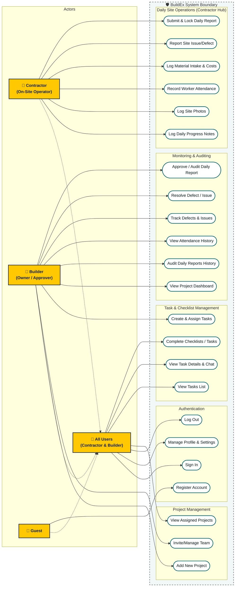

# BuildEx -- Use Case Diagram & Stitch Design Mapping

This document provides a comprehensive **Use Case Diagram** for the BuildEx Mobile Application. It details the interactions between different roles (Actors) and the system functionality (Use Cases), mapping each directly to the registered high-fidelity **Stitch Design screens**.

---

## 1. Mermaid Use Case Diagram

The diagram below visualizes the system boundaries, actors, and use cases. It demonstrates who can perform each function and categorizes the capabilities into functional sub-modules.

---

## 2. Actors Definition

| Actor | Type | Description | Inherits Roles |
| :--- | :--- | :--- | :--- |
| **Guest** | Primary | An unauthenticated user accessing the sign-up flow. | None |
| **All Users** | Abstract | Shared base functionality available to both Contractor and Builder. | None |
| **Contractor** | Primary | The on-site operator responsible for daily tasks, crew check-ins, photo evidence, and material logging. | All Users |
| **Builder** | Primary | The project owner / admin who configures projects, monitors overall completion, audits historical logs, and allocates tasks. | All Users |

---

## 3. Use Case to Stitch Screen Synchronization Matrix

Every use case corresponds directly to one or more screen designs in the Stitch design workspace.

| Sub-Module | Use Case | Primary Actor | Stitch Screen Name | Stitch Screen ID | Purpose |
| :--- | :--- | :--- | :--- | :--- | :--- |
| **Auth** | Register Account | Guest | **Create Account** | `3a0d042f6a414326860e3b61374a77d4` | Create a new user profile. |
| **Auth** | Sign In | Guest / All | **Sign In** | `e716a31a16584ac4aa47c273d1ea87ba` | Sign in to access the system dashboard. |
| **Auth** | Manage Profile | All Users | **My Profile** | `b136f4d8fe4e44a9b1d1d6307717463d` | Edit personal info, manage settings, toggle alerts. |
| **Auth** | Log Out | All Users | **My Profile** | `b136f4d8fe4e44a9b1d1d6307717463d` | Terminate session and clear state. |
| **ProjMgmt** | View Assigned Projects | All Users | **My Projects** | `44ad4540281d4ca0898c2fe2a4508216` | Browse active and pending construction projects. |
| **ProjMgmt** | Add New Project | Builder | **Add New Project** | `f46110e352dd4f6f8fa6e1f6e7c34b01` | Create a site and select lifecycle templates. |
| **ProjMgmt** | Invite/Manage Team | Builder | **My Team** / **Invite Team Member** | `8b06dea2a4bf42e8bbc74416dd88f146` / `7e385eb03db9470795e16f596d7f78ca` | Manage directory roster and invite team members. |
| **Ops** | Log Daily Progress Notes | Contractor | **Daily Progress** | `fbe6099b23044bee967d4270ae7f4e01` | Record physical milestones and daily text reports. |
| **Ops** | Log Site Photos | Contractor | **Site Photos** | `86113211eb28489381a6f0f9caef4e2d` | Snapping and tagging daily site photos. |
| **Ops** | Record Worker Attendance | Contractor | **Worker Attendance** | `af60e6b8087a4cd6a67a70ca2e3b60e` | Take roll-call checkboxes for crew members. |
| **Ops** | Log Material Intake & Costs | Contractor | **Material Log** | `39f244bc9c9745eda6b6143bafbfb70b` | Input concrete/sand delivery metrics and costs. |
| **Ops** | Report Site Issue/Defect | Contractor | **Report Issue** | `76203631429c47f498b7a1989506b5bc` | Log defect/blocker tickets with priority tags. |
| **Ops** | Submit & Lock Daily Report | Contractor | **Daily Report Summary** | `1ed6f3d594b449508a67a70ca2e3b60e` | Compile daily inputs and lock submission to cloud. |
| **Monitoring**| View Project Dashboard | Builder | **Project Dashboard** | `c041fbbbbc1d49b39921bea8fdb1e3c3` | Monitor overall cost, timeline, and daily tasks list. |
| **Monitoring**| Audit Daily Reports History| Builder | **Daily Reports History** | `e48c5a51b48a4b0188a37a266a0f79fa` | View past submitted daily summaries calendar list. |
| **Monitoring**| Approve / Audit Daily Report| Builder | **Daily Report Audit** | `f955a7a5c8574b45a5403ae97e77a539` | Audit full daily log and download PDF reports. |
| **Monitoring**| View Attendance History | Builder | **Attendance History** | `dda387cd60584ff68d3c3293385dafcf` | Audit past employee presence and attendance calendar. |
| **Monitoring**| Track Defects & Issues | Builder | **Issues & Defects Tracker** | `37b3a92c96b7444c89b17c8f9ce2fc48` | View global active defect tracker. |
| **Monitoring**| Resolve Defect / Issue | Builder | **Issue Detail** | `8f23f2c3376d440dbe13e7f5681d8d91` | Collaborate on issues, edit severity, and mark resolved. |
| **Tasks** | View Tasks List | All Users | **My Tasks** | `6fc9ba7256b740f7ab526454baf71478` | Browse personal checklists and agenda items. |
| **Tasks** | View Task Details & Chat | All Users | **Task Details** | `4439d870eaf4484b88b1b58547b5fb25` | View task checklist, attachment files, and task logs. |
| **Tasks** | Complete Checklists / Tasks | All Users | **My Tasks** / **Task Details** | `6fc9ba7256b740f7ab526454baf71478` / `4439d870eaf4484b88b1b58547b5fb25` | Check/uncheck milestones and complete task stages. |
| **Tasks** | Create & Assign Tasks | Builder | **Add New Task** | `ed5624f9ad8b4467987c58c57815906a` | Issue new work allocation to Contractors. |
