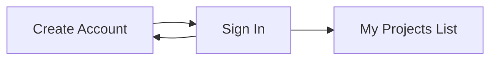
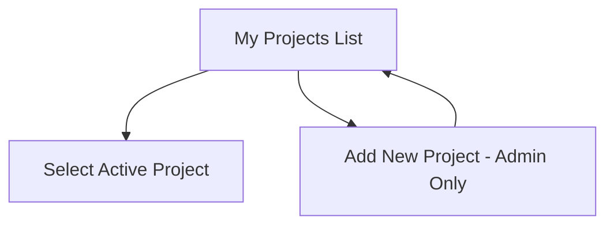
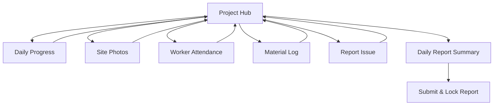
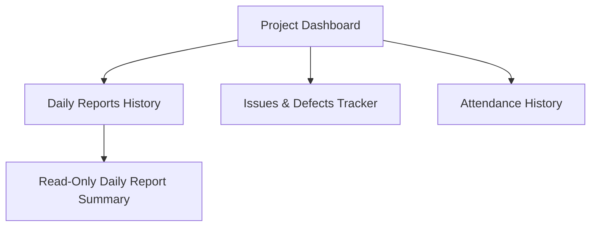
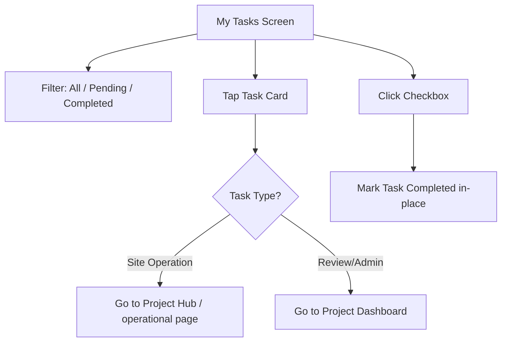
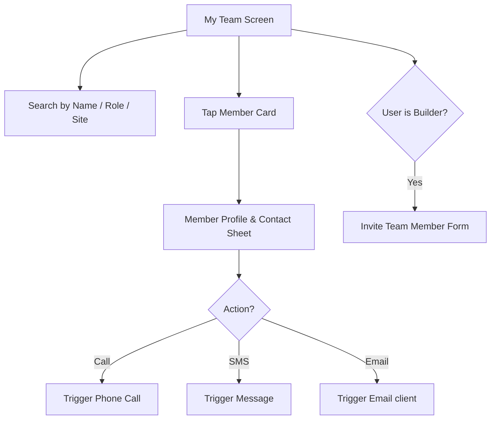
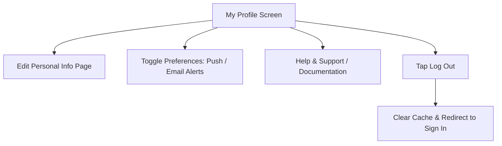

# BuildTrack -- User Workflow & Navigation Map

This document outlines the step-by-step user journeys and navigation flows for the **BuildTrack** Mobile Application, mapping directly to the screens designed in the Stitch project.

---

## 1. Onboarding & Authentication Flow



### Step 1: Create Account
*   **Screen:** `Create Account` (or `Create Account - Refined`)
*   **Action:** New users register by entering their Full Name, Email, Password, and Confirm Password. Tapping **SIGN UP** registers the user.
*   **Navigation:** Existing users can tap the bottom link *"Already have an account? Sign In"* to toggle to the Sign In screen.

### Step 2: Sign In
*   **Screen:** `Sign In` (or `Sign In - BuildEx Redesign` / `Sign In - Refined`)
*   **Action:** Registered users enter their Username/Email and Password, then tap **SIGN IN**.
*   **Navigation:** Upon successful authentication, the system automatically redirects the user to the **My Projects** list. A *"Forgot Password?"* secondary action is available.

---

## 2. Project Selection Flow



### Step 3: My Projects
*   **Screen:** `My Projects`
*   **Action:** The user sees a list of active and on-hold construction sites assigned to them. Each project card summarizes the site name, location, today's report status (e.g., `DRAFT`, `SUBMITTED`, `PENDING`), and overall completion percentage.
*   **Navigation:**
    *   **Main Card Tap:**
        *   If the user is a **Site Manager**, it opens the **Project Hub** (Editable operations cockpit).
        *   If the user is a **Site Builder**, it opens the **Project Dashboard** (Read-only monitoring view).
    *   **Quick Update Icon Tap (Site Builder Shortcut):**
        *   Site Builders can tap the **Quick Update** (`edit_note`) shortcut icon directly on the card to bypass the dashboard and open the **Project Hub** (Editable operations cockpit).
    *   **Trigger to Add New Project:** Site Builders can tap the **New Project** card (the yellow card with `add_circle` icon) to open the **`Add New Project`** screen.

### Step 4: Add New Project (Site Builder Only)
*   **Screen:** `Add New Project`
*   **Action:** Input the project details: Project Name, Site ID, Location, Allocated Budget, expected completion date, assigned Site Manager, and baseline lifecycle template. Saving registers the project in the database.
*   **Navigation:** Navigates back to the **My Projects** list.

---

## 3. Site Manager Flow (Data Entry & Submission)

This flow is designed for the on-site Site Manager who coordinates daily work, logs materials, records attendance, and compiles the daily report. 

> [!NOTE]
> The **Site Builder** (Main Builder) also has access to see and view all of the Site Manager's data entry pages for monitoring.



### Step 5: Project Hub (Site Manager's Cockpit)
*   **Screen:** `Project Hub`
*   **Action:** Acts as the primary daily checklist. Displays today's progress bar (e.g., 65%) and the remaining steps.
*   **Navigation:** Contains a 2-column action grid leading to data logging sub-pages:
    *   **Progress Notes** $\rightarrow$ `Daily Progress`
    *   **Site Photos** $\rightarrow$ `Site Photos`
    *   **Labor Attendance** $\rightarrow$ `Worker Attendance`
    *   **Material Log** $\rightarrow$ `Material Log`
    *   **Report Issue / Defect** $\rightarrow$ `Report Issue`
    *   **Primary CTA (SUBMIT DAILY REPORT)** $\rightarrow$ `Daily Report Summary`

### Step 6: Logging Today's Progress Notes
*   **Screen:** `Daily Progress`
*   **Action:** The engineer inputs multiline details of the work done today. Selects today's status: `On Track`, `Delayed`, or `Blocked`.
*   **Navigation:** Tapping **SAVE NOTES** saves a draft and returns to the `Project Hub`.

### Step 7: Capturing Site Photos
*   **Screen:** `Site Photos`
*   **Action:** Snaps new progress photos using the device camera or selects from the gallery. Displays recent photo uploads as thumbnail cards.
*   **Navigation:** Tapping **SAVE PHOTOS** uploads the images and returns to the `Project Hub`.

### Step 8: Recording Worker Attendance
*   **Screen:** `Worker Attendance`
*   **Action:** Shows total crew, present, and absent counts. Features a worker directory where the manager checks/unchecks toggles to mark crew members `Present` or `Absent`.
*   **Navigation:** Tapping **SAVE ATTENDANCE** logs the attendance roll call and returns to the `Project Hub`.

### Step 9: Logging Material Intake
*   **Screen:** `Material Log`
*   **Action:** Records materials received on-site (Material Type, Quantity, Unit). Adds them to a temporary "Recent Entries" table on the page.
*   **Navigation:** Tapping **SAVE MATERIAL LOG** saves the materials list and returns to the `Project Hub`.

### Step 10: Reporting a Defect / Issue
*   **Screen:** `Report Issue` (or `New Defect Report`)
*   **Action:** Logs construction defects, safety concerns, or supply chain bottlenecks. Selects Severity (`Low`, `Medium`, `High`, `Critical`), inputs a description, and attaches a photo.
*   **Navigation:** Tapping **LOG ISSUE** submits the defect report and returns to the `Project Hub`.

### Step 11: Daily Report compilation
*   **Screen:** `Daily Report Summary`
*   **Action:** The system aggregates all drafts saved today into a single, clean preview page. The Site Manager reviews the compiled sections (Progress description, Worker Attendance summary, Materials expense receipts, uploaded Photos, and active Issues).
*   **Navigation:** Tapping **SUBMIT REPORT TO CLOUD** locks today's logs, pushes the locked report to the database, and redirects the engineer back to the `My Projects` list.

---

## 4. Site Builder Flow (Remote Monitoring)

This flow is designed for the Site Builder (Main Builder) to remotely monitor progress, audit daily logs, track defects, and view trends across multiple sites without needing to visit manually or make phone calls.



### Step 12: Project Dashboard (Owner's View)
*   **Screen:** `Project Dashboard`
*   **Action:** Displays real-time site performance: overall completion rate (e.g. 65%), budget parameters (Spent Today vs. Total Budget Cost), and a checked/unchecked overview list of today's operational logs.
*   **Navigation:** Tapping details or history links opens tracking screens:
    *   **View Daily Report Details** $\rightarrow$ `Daily Reports History`
    *   **Open Issues / Defect list** $\rightarrow$ `Issues & Defects Tracker`
    *   **Labor Attendance Details** $\rightarrow$ `Attendance History`

### Step 13: Auditing Daily Reports History
*   **Screen:** `Daily Reports History`
*   **Action:** Displays a scrollable historical log of all daily reports submitted for the project. Features quick filters (`All`, `This Week`, `This Month`, `Drafts`).
*   **Navigation:** Tapping any daily report card opens the **`Daily Report Audit`** screen for detailed review.

### Step 14: Defect Tracking & Management
*   **Screen:** `Issues & Defects Tracker`
*   **Action:** Displays all logged site defects. Filter chips allow isolating critical blocks. Cards detail severity badges, reporting user, and visual evidence (photo thumbnails).
*   **Navigation:** Clicking an issue card opens the **`Issue Detail`** screen.

### Step 15: Reviewing Attendance Logs
*   **Screen:** `Attendance History`
*   **Action:** Displays past attendance roll calls. Users select a date from the weekly strip or click the calendar icon to view statistics (Total Crew, Present, Absent) and the individual attendance list for that day.
*   **Navigation:** Tapping **EDIT TODAY'S ATTENDANCE** opens the editable roll call screen if edits are required.

### Step 16: Issue Detail & Collaboration
*   **Screen:** `Issue Detail`
*   **Action:** Displays full-size defect photo, reporting metadata, severity, timeline, and chat thread.
*   **Navigation:** Tapping **RESOLVE ISSUE** marks the issue resolved.

### Step 17: Task Details & Checklists
*   **Screen:** `Task Details`
*   **Action:** Displays detailed checklists, task status, assignees, due dates, and real-time chat updates.
*   **Navigation:** Tapping checkboxes marks checklist sub-tasks as completed; tapping **COMPLETE TASK** updates the task state.

---

## 5. Universal Navigation Features

On all primary home screens (`My Projects`, `My Tasks`, `My Team`, `My Profile`), a persistent **Bottom Navigation Bar** allows the user to switch contexts instantly.

```
+-------------------------------------------------+
|  [Projects]     [Tasks]     [Team]    [Profile] |
+-------------------------------------------------+
```

---

## 6. Tasks Tab Workflow (`My Tasks`)

This flow allows users to manage their daily agendas and action items.



### Flow Details
*   **Screen:** `My Tasks`
*   **Step 1: Accessing Tasks:** The user taps the **Tasks** tab in the bottom nav to load the **My Tasks** screen.
*   **Step 2: Filtering Tasks:** The user filters tasks using top chips (`All`, `Pending`, `Completed`) or search.
*   **Step 3: Direct Action Shortcuts:**
    *   Tapping the main body of a task card opens the **`Task Details`** screen to review detailed sub-checklists and user comment threads.
    *   Tapping the **"Update"** button on a task related to data collection (e.g., *"Log concrete delivery for Metro Line"*) redirects the Site Manager directly to the **Material Log** page of that project.
    *   Tapping the checkbox directly on the task card marks it as done without leaving the page.
*   **Trigger to Add New Task:** Tapping the yellow `+` Floating Action Button (FAB) in the bottom-right of the **My Tasks** screen opens the task creation form.

---

## 7. Team Tab Workflow (`My Team`)

This directory allows the Site Builder and Site Managers to coordinate and contact staff on-site.



### Flow Details
*   **Screen:** `My Team`
*   **Step 1: Accessing Team Directory:** The user taps the **Team** tab in the bottom nav to load the **My Team** screen.
*   **Step 2: Searching Personnel:** The directory displays all managers, builders, and workers. It can be filtered by active project site or role.
*   **Step 3: Accessing Contact Options:** Tapping any member card opens a bottom sheet detailing their role, assigned site, active tasks, and direct quick-action buttons (Call, SMS, Email).
*   **Trigger to Invite Member (Site Builder Only):** Tapping the yellow `+` Floating Action Button (FAB) in the bottom-right of the **My Team** screen (visible only to Site Builders) opens the **Invite Team Member** registration form.

---

## 8. Profile Tab Workflow (`My Profile`)

This settings hub is where users manage their accounts and app preferences.



### Flow Details
*   **Screen:** `My Profile`
*   **Step 1: Accessing Profile:** The user taps the **Profile** tab in the bottom nav to load the **My Profile** screen.
*   **Step 2: Managing Details:**
    *   **Edit Profile:** Opens a form to edit Name, Avatar, phone number, and password.
    *   **Notification Toggles:** Simple toggles to enable/disable specific notifications (e.g., *Daily Report due warnings*, *Defect alerts*, *Budget cap notifications*).
    *   **Help & Support:** Direct link to documentation, training videos, and customer support.
*   **Step 3: Logging Out:** Tapping the **Log Out** button clears the local session token and redirects the user back to the **Sign In** screen.

