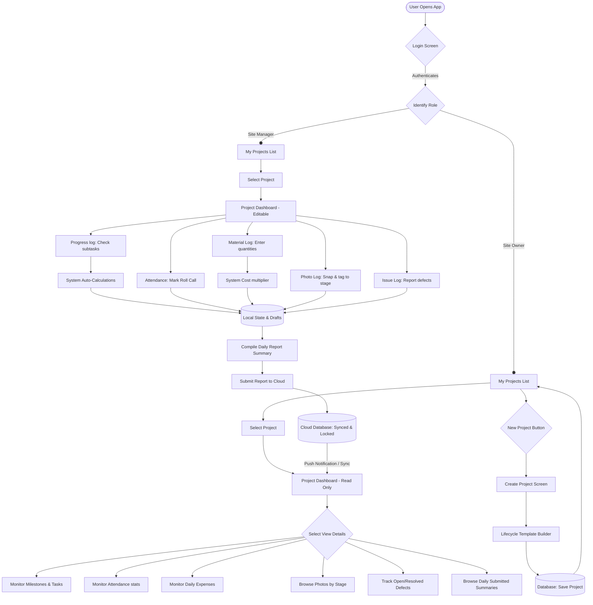

# BuildTrack -- End-to-End Workflow & Architecture Design

This document outlines the logical workflow, user journeys, navigation structures, and data flows for the **BuildTrack** Mobile Application. It is designed to act as a technical blueprint for the Flutter frontend and database synchronization implementation.

---

## 1. User Journeys by Role

The application has two distinct user journeys tailored to role-specific requirements.

### Site Manager (On-Site Operator)
*   **Core Goal:** Quick, effortless daily data entry in rugged site environments with minimal typing.
*   **Journey Map:**
    1.  **Authentication:** Login $\rightarrow$ Directed automatically to **My Projects** list.
    2.  **Selection:** Selects active project (e.g. Metro Line Phase 2A) $\rightarrow$ Lands on **Project Dashboard**.
    3.  **Operations:** Taps navigation items to record:
        *   *Attendance:* Toggle Present/Absent for crew.
        *   *Progress:* Check off subtasks in active construction stages.
        *   *Materials:* Input daily material intake and unit price.
        *   *Photos:* Snap site progress photos, tag to a stage, and add notes.
        *   *Issues:* Log new defects, attach a photo, and set priority.
    4.  **Submission:** Reviews generated summary in **Daily Report** $\rightarrow$ Submits to cloud.

### Site Owner / Project Manager (Remote Monitor)
*   **Core Goal:** Real-time visibility into cost, timeline delay alerts, and progress reports across all sites.
*   **Journey Map:**
    1.  **Authentication:** Login $\rightarrow$ Directed automatically to **My Projects** list.
    2.  **Creation (Admin only):** Taps "New Project" to spin up a site, inputs metadata, and sets active templates.
    3.  **Monitoring (Read-Only Dashboard):** Selects active project $\rightarrow$ Monitors real-time stats:
        *   Total today's expense vs. total budget.
        *   Overall completion progress percentage.
        *   Timeline feed of site manager's logged events.
        *   Review photos by date/stage and track open critical issues.

---

## 2. Mermaid Workflow & Navigation Map

The flowchart below visualizes user navigation paths, decision gates, and data pathways for both roles:



---

## 3. Data Flow & Dashboard Synchronization

The application relies on a **Single Source of Truth** architecture to ensure that Site Manager updates propagate instantly to the Site Owner's read-only dashboard.

```
+--------------------------+
|  Site Manager Local Log  |  --[Local Updates (State Management)]--> (Today's Draft)
+--------------------------+                                                    |
                                                                                |
                                                                   [Submit Daily Report]
                                                                                |
                                                                                v
+--------------------------+                                        +-----------------------+
|  Site Owner Dashboard    |  <--[Real-time Stream/Subscription]--  |    Cloud Database     |
+--------------------------+                                        +-----------------------+
```

### State Management & Lifecycle
*   **Site Manager:** Updates are held in local state (e.g. Flutter Bloc/Provider). The manager can continuously edit throughout the day. Values are saved as a "Today's Draft". Once the "Submit Daily Report" button is pressed, the record is pushed to the cloud and locked.
*   **Site Owner:** Subscribes to the cloud database collection via a real-time Stream (e.g., Firestore Streams). The dashboard updates dynamically in real-time as tasks are checked off, or issues are logged.

---

## 4. Overall Progress Calculation Logic

Progress metrics are completely automated to prevent errors and manual data manipulation by engineers on-site.

### 1. Stage Progress Percentage
Each construction template is composed of **N** stages, and each stage contains **M** discrete subtasks. Subtask progress is binary (Completed or Not Completed).
$$\text{Stage Progress (\%)} = \left( \frac{\text{Completed Subtasks in Stage}}{\text{Total Subtasks in Stage}} \right) \times 100$$

*   *Example:* Under **Foundation Construction**:
    *   [x] Excavation (1)
    *   [x] PCC (1)
    *   [ ] Reinforcement (0)
    *   [ ] Concrete Pouring (0)
    *   [ ] Curing (0)
    *   **Calculation:** $2 \div 5 = 40\%$ completed.

### 2. Overall Project Progress Percentage
To reflect realistic timelines, each construction stage is assigned a **weight percentage** ($\text{W}_i$) representing its complexity or duration. The sum of all weights must equal 100%.
$$\text{Overall Project Progress (\%)} = \sum_{i=1}^{N} \left( \text{Stage Progress}_i \times \text{Weight}_i \right)$$

If weights are distributed equally across the 10 stages of the default template, each stage accounts for 10% of the overall progress:
$$\text{Overall Project Progress (\%)} = \sum_{i=1}^{10} \left( \text{Stage Progress}_i \times 10\% \right)$$

---

## 5. Module-by-Module Workflows

### 1. Project Initialization & Customization
1.  **Trigger:** Owner clicks "New Project".
2.  **Data Entered:** Project Name, Location, Budget, expected completion date, and Site Manager assignment.
3.  **Template Customization:**
    *   App displays the default 10-stage lifecycle template.
    *   Owner can reorder stages (drag-and-drop), delete stages (e.g., if Flooring is excluded), or add custom stages.
    *   Owner edits subtasks within each stage.
4.  **Lock Gate:** Upon saving, the template structure is serialized to the database as `project_lifecycle` and locked.

### 2. Material Cost Calculations
1.  **Trigger:** Site Manager logs material intake (e.g. 50 bags of cement).
2.  **Inputs:** `Material Name` (Text/Autocomplete), `Quantity` (Double), `Unit` (Pill selector: Bags, CFT, Tons, Liters), `Unit Price` (Double).
3.  **Automated Calculations:**
    $$\text{Cost} = \text{Quantity} \times \text{Unit Price}$$
4.  **Dashboard Update:** The sum of all costs logged today is calculated:
    $$\text{Today's Expense} = \sum \text{Cost}_{\text{today}}$$
    This updates the **Spent Today** metric on the Project Dashboard immediately.

### 3. Worker Attendance Tracker
1.  **Trigger:** Site Manager opens attendance roll call.
2.  **Input:** System displays list of workers assigned to the project. Manager taps checkboxes to mark each worker `Present` or `Absent`.
3.  **State Save:** Saves to `daily_attendance_log`.
4.  **Dashboard Update:** Real-time counter displays **Workers Present Today** (Total Present Workers / Total Allocated Workers).

### 4. Site Issue Logs
1.  **Trigger:** Site Manager reports a defect on-site.
2.  **Inputs:** Title, description, priority (Low/Medium/High/Critical), stage tag (dropdown of project stages), and optional camera capture.
3.  **System Action:** Generates a new issue object with status `OPEN`.
4.  **Dashboard Update:** Increments the **Open Issues** counter on the Project Dashboard. Trigger a warning highlight if priority is set to **Critical**.

### 5. Photo Storage Hierarchy
1.  **Trigger:** Manager snaps a picture.
2.  **Inputs:** Stage selection, short text note.
3.  **Storage Logic:** The image file is uploaded to cloud storage and structured in folders organized by project, date, and construction stage:
    `projects/{project_id}/photos/{yyyy-mm-dd}/{stage_id}/{image_id}.jpg`
4.  **Dashboard Update:** Increments the **Photos Uploaded Today** metric.

### 6. Daily Report compilation
1.  **Compilation Trigger:** Site Manager taps "Submit Daily Report" in the footer.
2.  **System Compilation:** The system fetches all logs created today:
    *   Calculated progress changes ($\Delta$ progress)
    *   Attendance list summary (Total Present)
    *   Total material expenditure receipts
    *   Photos captured today
    *   Active blockers or issues logged
3.  **Review Screen:** Manager reviews the compiled summary document.
4.  **Publish Gate:** Manager signs off and submits. The database updates `last_report_submitted_date` and marks today's log status as `SUBMITTED`.
