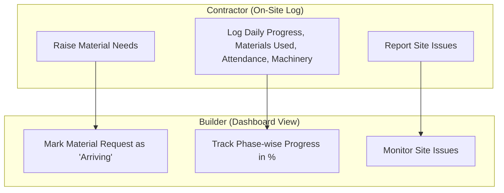

# BuildEx - System Design: Problem, Solution, Features & Users (Builder-Contractor Model)

This document defines the core business requirements, product scope, and user model for **BuildEx**, structured around the real-world operational relationship between a **Builder (Developer)** and a **Contractor**.

---

## 1. The Builder-Contractor Relationship

BuildEx connects two primary roles to manage site progress and materials:
1. **The Builder (Developer / Owner):** 
  * Monitors progress in percentage completion based on a detailed phase/sub-phase list.
  * Reviews material requests from the contractor and updates them to "Arriving" status.
  * Monitors active site issues on their central dashboard.
2. **The Contractor (Execution Agency):** 
  * Submits daily progress reports (what work was done, materials used, labor attendance, and machinery used).
  * Raises material needs (requests) when stock is low.
  * Reports site issues/snags.

---

## 2. Core Problem Statement

### Challenges in Traditional Operations
* **No Phase-wise Progress Tracking:** Builders do not know the exact percentage of completion for milestones like "Substructure" or "Digging & Base Creation."
* **Disconnected Material Requests:** Contractors request materials via phone/chat. The builder orders them, but the contractor has no real-time update on when the materials will arrive.
* **Daily Report Delays:** Builders have to call the contractor every evening to know about labor attendance, material consumption, and machinery usage.

---

## 3. Product Module Breakdown

### 1. Builder Dashboard (What the Builder Sees)
* **A. Progress Tracking (Phases & Sub-points):**
  * Displays overall and phase-wise completion in **percentages**.
  * Follows a strict hierarchy:
    * *Phase 1: Substructure*
      * Area Inspection (Sub-point)
      * Architecture Design (Sub-point)
    * *Phase 2: Digging and Base Creation*
      * Clean Area (Sub-point)
      * Clean Site (Sub-point)
* **B. Material Approval Panel:**
  * View pending material requests from the contractor.
  * Approve and change status to **"Arriving"** (updating the contractor on delivery).
* **C. Issue Tracker:**
  * Real-time list of site blockages, defects, and safety snags.

### 2. Contractor App (What the Contractor Does)
* **A. Daily Progress Report (DPR):**
  * Select active sub-points (e.g. "Clean Area" under Phase 2) and mark them as complete.
  * Enter **materials used** today (e.g., "50 bags of cement").
  * Mark **labor attendance** (number of workers on site).
  * Log **machinery used** (e.g., "JCB operated for 4 hours").
* **B. Material Needs Portal:**
  * Raise requests for materials (e.g., "Need 100 bags of cement").
  * View the status of requested materials (Pending -> Approved/Arriving).
* **C. Report Site Issues:**
  * Quick form to report defects or problems with photos.

---

## 4. Scoped Features & Phases (MVP vs. Phase 2)

### Phase 1 (MVP Scope)
The MVP focuses on the daily communication loop: Contractor logs work & requests -> Builder tracks progress & approves requests.

| Feature Area | Role | MVP Functionality |
| :--- | :--- | :--- |
| **User Access** | Shared | Simple login and role assignment (Builder or Contractor). |
| **Progress Tracker** | Shared | Contractor updates sub-points; Builder sees phase progress in %. |
| **Material Requests** | Shared | Contractor raises requests; Builder reviews and marks them as "Arriving". |
| **Daily Consumption** | Contractor | Log quantities of materials used today. |
| **Daily Site Logs** | Contractor | Log worker attendance, machinery usage, and site photos. |
| **Issue Logger** | Shared | Contractor reports issues; Builder monitors them on dashboard. |

### Phase 2 (Future Scope)
* **Vendor Purchasing:** Builder can upload and store invoices directly from vendors inside the app.
* **Offline Logging:** Allow the contractor to submit logs offline, which auto-sync when network is available.
* **Automated Alerts:** Send instant WhatsApp or Push Notifications when material status changes to "Arriving."

---

## 5. Roles & Permissions Matrix

| System Action | Builder | Contractor |
| :--- | :---: | :---: |
| Mark Sub-point as Completed | Cross (✗) | Check (✓) |
| View Phase Progress (%) | Check (✓) | Check (✓) |
| Raise Material Request (Needs) | Cross (✗) | Check (✓) |
| Update Material Request to "Arriving" | Check (✓) | Cross (✗) |
| Log Daily Material Usage | Cross (✗) | Check (✓) |
| Mark Worker Attendance & Machinery | Cross (✗) | Check (✓) |
| Report Site Issue (Snags) | Check (✓) | Check (✓) |
| Close Site Issue (Snags) | Check (✓) | Cross (✗) |
