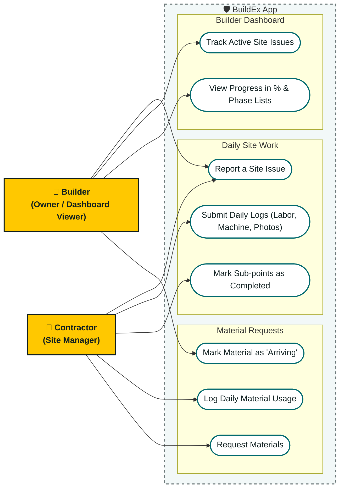

# BuildEx - System Design: Use Cases & Workflows (Simplified)

This document explains what the **Builder** and the **Contractor** can do inside the **BuildEx** app, written in simple everyday language.

---

## 1. User Roles

* **Builder (Owner):** 
  * Wants to see a **Dashboard** with overall project progress (in %).
  * Wants to track progress divided by **Phases (Points)** and **Sub-phases (Sub-points)** (e.g., *Phase 1: Substructure* -> *Area Inspection*).
  * Reviews material requests and updates the status to **"Arriving"**.
  * Monitors active site issues.
* **Contractor (Site Manager):** 
  * Submits **Daily Progress Reports (DPR)** (work done, materials used, labor attendance, machinery logs).
  * Marks phase sub-points as completed.
  * Sends requests for materials (**Material Needs**).
  * Reports site issues.

---

## 2. Use Case Diagram

This diagram shows what the Builder and Contractor do inside the app.

---

## 3. How the Main Features Work (Step-by-Step)

Here are the 4 main workflows explaining what the contractor does daily, what the builder does, and what the builder sees.

### 1. Progress Tracking (Phases & Percentages)

* **What is it?** How the builder tracks progress using phases and sub-points.
* **Who does what?**
  * **Contractor** marks tasks (sub-points) as completed.
  * **Builder** monitors the phase completion percentages.
* **How it works step-by-step:**
  1. The project is set up with Phases and Sub-points:
     * *Phase 1: Substructure*
       * Area Inspection (Sub-point 1)
       * Architecture Design (Sub-point 2)
     * *Phase 2: Digging and Base Creation*
       * Clean Area (Sub-point 1)
       * Clean Site (Sub-point 2)
  2. The **Contractor** completes a task (e.g., "Clean Area") and marks it completed in the app.
  3. The app automatically calculates the completion percentage for that Phase and the overall project.
* **What the Builder sees on the Dashboard:** Overall progress (e.g., *"Overall Progress: 35%"*) and a breakdown of completed points under each Phase.

---

### 2. Material Requests & Updates ("Arriving")

* **What is it?** How the contractor requests materials and how the builder updates their delivery status.
* **Who does what?**
  * **Contractor** raises requests.
  * **Builder** updates status to "Arriving."
* **How it works step-by-step:**
  1. **Contractor** raises a request (e.g., "Need 100 bags of cement").
  2. **Builder** sees this request on their dashboard.
  3. **Builder** orders it from the supplier and marks the request status as **"Arriving"** inside the app.
  4. The **Contractor** sees the "Arriving" status on their phone so they know when to expect it.
* **What the Builder sees on the Dashboard:** A list of active contractor material requests and their status (Pending / Arriving).

---

### 3. Daily Site Logs (DPR)

* **What is it?** Daily records of labor, machinery, and materials used.
* **Who does what?**
  * **Contractor** logs usage daily.
  * **Builder** views daily details.
* **How it works step-by-step:**
  1. Throughout the day, the **Contractor** logs:
     * **Material Used:** e.g., "Used 50 bags of cement for roof casting."
     * **Labor Attendance:** e.g., "10 masons, 12 helpers present."
     * **Machinery:** e.g., "Mixer machine used for 3 hours."
  2. Contractor uploads site photos and submits the log.
* **What the Builder sees on the Dashboard:** A simple summary of daily operations, material consumption, and total workers present.

---

### 4. Tracking Site Issues (Snags)

* **What is it?** Logging and tracking defects or delays.
* **Who does what?**
  * **Contractor / Builder** logs issues.
  * **Builder** tracks them until closed.
* **How it works step-by-step:**
  1. If a problem occurs (e.g., "Water leakage in column"), the **Contractor** (or Builder) logs it with a photo.
  2. The **Builder** sees this active issue highlighted on their dashboard.
  3. Once the contractor fixes the issue, they upload a photo of the resolved work.
  4. The **Builder** verifies and marks the issue as "Closed."
* **What the Builder sees on the Dashboard:** A list of unresolved site issues and photos of fixed items.
