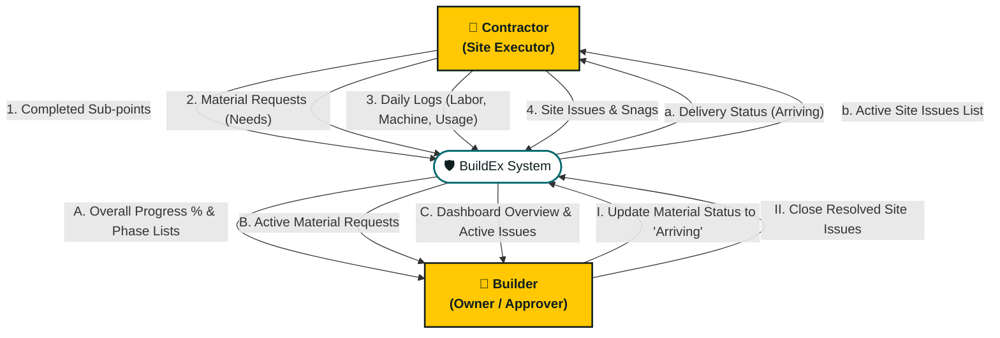
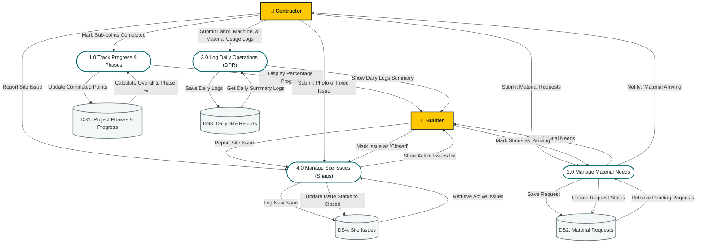

# BuildEx - System Design: Data Flow Diagrams (DFD)

This document shows how information (data) flows through the **BuildEx** system. It helps explain where the contractor's inputs go, how they are stored, and what the builder sees on the dashboard.

---

## 1. Level 0 DFD (Context Diagram)

The Level 0 diagram shows the big picture: how the **Builder** and the **Contractor** send and receive information through the **BuildEx App**.

---

## 2. Level 1 DFD (Detailed Data Flows)

The Level 1 diagram breaks the BuildEx app down into its **4 core processes** and shows how data is saved in different databases (**Data Stores**).

---

## 3. Simple Data Flow Explanations

Here is what happens inside each of the 4 databases:

### DS1: Project Phases & Progress Database
* **Input from Contractor:** Checks off completed tasks (e.g., *Area Inspection*).
* **Output to Builder Dashboard:** Shows simple progress bars (e.g., *Substructure is 50% done*, *Overall Project is 12% done*).

### DS2: Material Requests Database
* **Input from Contractor:** List of materials needed (Cement, Sand, etc.).
* **Action by Builder:** Taps "Mark Arriving" when ordered.
* **Output to Contractor:** Changes status color from red (Pending) to yellow (Arriving) on their phone.

### DS3: Daily Site Reports Database
* **Input from Contractor:** Daily logs including worker count, machine hours, and material consumed today.
* **Output to Builder Dashboard:** A clean daily report ledger summarizing how resources are being used.

### DS4: Site Issues Database
* **Input from Contractor/Builder:** Defect reports with photos.
* **Action by Contractor:** Marks resolved with fix photo.
* **Action by Builder:** Closes the ticket.
* **Output to Builder Dashboard:** Highlighted warnings of unresolved issues on site.
