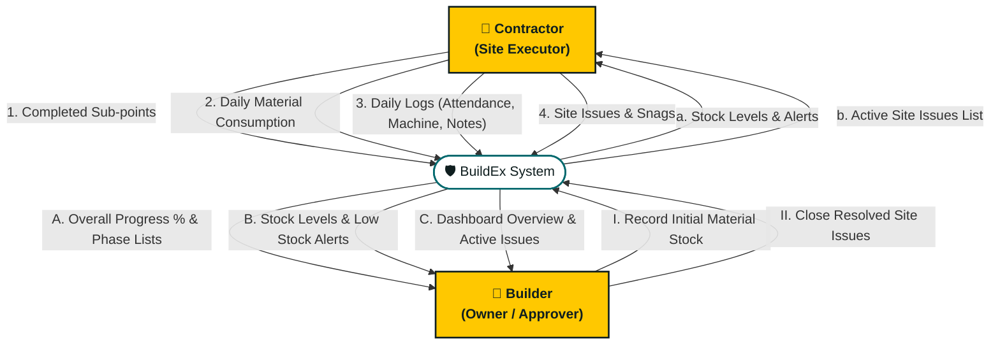
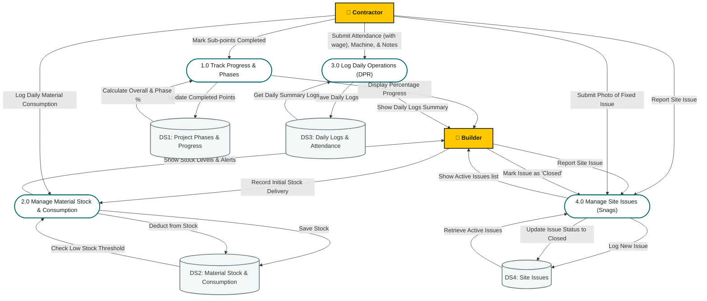

# BuildEx - System Design: Data Flow Diagrams (DFD)

This document shows how information (data) flows through the **BuildEx** system. It helps explain where the contractor's inputs go, how they are stored, and what the builder sees on the dashboard.

---

## 1. Level 0 DFD (Context Diagram)

The Level 0 diagram shows the big picture: how the **Builder** and the **Contractor** send and receive information through the **BuildEx App**.

---

## 2. Level 1 DFD (Detailed Data Flows)

The Level 1 diagram breaks the BuildEx app down into its **4 core processes** and shows how data is saved in different databases (**Data Stores**).

---

## 3. Simple Data Flow Explanations

Here is what happens inside each of the 4 databases:

### DS1: Project Phases & Progress Database
* **Input from Contractor:** Checks off completed tasks (e.g., *Area Inspection*).
* **Output to Builder Dashboard:** Shows simple progress bars (e.g., *Substructure is 50% done*, *Overall Project is 12% done*).

### DS2: Material Stock & Consumption Database
* **Input from Builder:** Records initial material stock delivered to site (e.g., *50 bags of cement*).
* **Input from Contractor:** Logs daily material consumption (e.g., *Used 10 bags of cement*).
* **System Action:** Auto-deducts consumed quantity from stock and alerts Builder when stock is low.
* **Output to Builder Dashboard:** Shows remaining stock levels and consumption trends.

### DS3: Daily Site Reports & Attendance Database
* **Input from Contractor:** Daily logs including progress notes, worker attendance (with daily wage), machinery hours, and material consumed today.
* **System Action:** Auto-calculates total wages payable per worker and aggregate labor cost.
* **Output to Builder Dashboard:** A clean daily report ledger with attendance summary, wage liability, and resource usage.

### DS4: Site Issues Database
* **Input from Contractor/Builder:** Defect reports with photos.
* **Action by Contractor:** Marks resolved with fix photo.
* **Action by Builder:** Closes the ticket.
* **Output to Builder Dashboard:** Highlighted warnings of unresolved issues on site.
