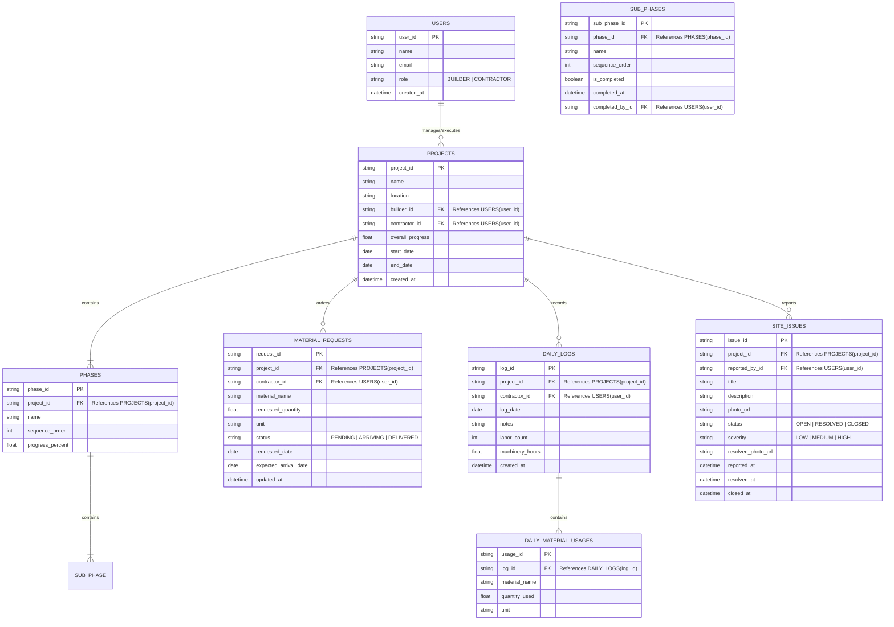
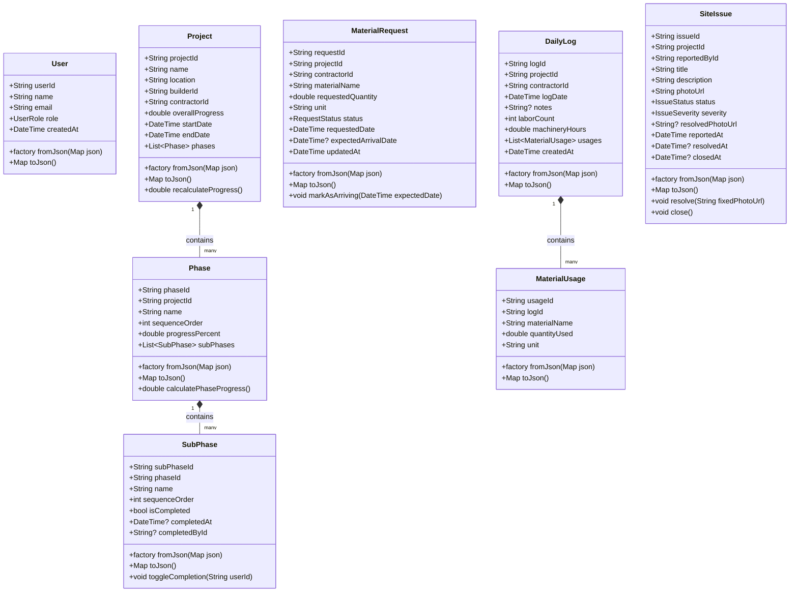

# BuildEx - System Design: Database Schema & Class Diagram

This document outlines the complete database schema (ER Diagram) and the client-side Flutter models (Class Diagram) for **BuildEx**. It details all data types, primary keys (PK), foreign keys (FK), and dependencies to ensure a robust, gap-free implementation.

---

## 1. Entity-Relationship (ER) Diagram

The ER diagram below models the database structure. It illustrates the relationships, primary keys, and foreign keys of all tables.

---

## 2. Detailed Database Table Definitions

### 1. `users` Table
Stores basic profile information and access roles for both Builders and Contractors.
* **Dependencies:** None.

| Column Name | Data Type | Key / Constraint | Description |
| :--- | :--- | :---: | :--- |
| `user_id` | VARCHAR(36) | **PK** | Unique identifier (UUID). |
| `name` | VARCHAR(100) | NOT NULL | User's full name. |
| `email` | VARCHAR(100) | UNIQUE, NOT NULL | Login and communication email. |
| `role` | VARCHAR(20) | CHECK (role IN ('BUILDER', 'CONTRACTOR')) | System role. |
| `created_at` | DATETIME | NOT NULL | Date and time of registration. |

---

### 2. `projects` Table
Represents construction project sites financed by a Builder and executed by a Contractor.
* **Dependencies:** Depends on `users` table.

| Column Name | Data Type | Key / Constraint | Description |
| :--- | :--- | :---: | :--- |
| `project_id` | VARCHAR(36) | **PK** | Unique identifier (UUID). |
| `name` | VARCHAR(150) | NOT NULL | Name of the project. |
| `location` | VARCHAR(255) | NOT NULL | Physical address/location of the site. |
| `builder_id` | VARCHAR(36) | **FK** -> `users(user_id)` | The Builder funding the project. |
| `contractor_id`| VARCHAR(36) | **FK** -> `users(user_id)` | The Contractor executing the project. |
| `overall_progress`| DECIMAL(5,2)| DEFAULT 0.00 | Overall completion percentage (0.00 to 100.00). |
| `start_date` | DATE | NOT NULL | Estimated or actual start date. |
| `end_date` | DATE | NOT NULL | Target completion date. |
| `created_at` | DATETIME | NOT NULL | Record creation date. |

---

### 3. `phases` Table
Represents high-level stages of construction (e.g., Substructure, Digging).
* **Dependencies:** Depends on `projects` table.

| Column Name | Data Type | Key / Constraint | Description |
| :--- | :--- | :---: | :--- |
| `phase_id` | VARCHAR(36) | **PK** | Unique identifier (UUID). |
| `project_id` | VARCHAR(36) | **FK** -> `projects(project_id)` | Project this phase belongs to. |
| `name` | VARCHAR(100) | NOT NULL | Name of the phase (e.g., "Substructure"). |
| `sequence_order` | INT | NOT NULL | Order of execution (1, 2, 3, etc.). |
| `progress_percent`| DECIMAL(5,2)| DEFAULT 0.00 | Progress percentage of this phase. |

---

### 4. `sub_phases` Table
Represents individual tasks under a Phase (e.g., Area Inspection). Completing these updates the Phase and Project progress percentage.
* **Dependencies:** Depends on `phases` and `users` tables.

| Column Name | Data Type | Key / Constraint | Description |
| :--- | :--- | :---: | :--- |
| `sub_phase_id` | VARCHAR(36) | **PK** | Unique identifier (UUID). |
| `phase_id` | VARCHAR(36) | **FK** -> `phases(phase_id)` | Parent phase. |
| `name` | VARCHAR(100) | NOT NULL | Task description (e.g., "Clean Area"). |
| `sequence_order` | INT | NOT NULL | Order of execution within parent phase. |
| `is_completed` | BOOLEAN | DEFAULT FALSE | Status of task completion. |
| `completed_at` | DATETIME | NULLABLE | Timestamp of completion. |
| `completed_by_id`| VARCHAR(36) | **FK** -> `users(user_id)` (NULLABLE) | The Contractor representative who completed it. |

---

### 5. `material_requests` Table
Tracks requests for materials initiated by the Contractor and fulfilled/marked "Arriving" by the Builder.
* **Dependencies:** Depends on `projects` and `users` tables.

| Column Name | Data Type | Key / Constraint | Description |
| :--- | :--- | :---: | :--- |
| `request_id` | VARCHAR(36) | **PK** | Unique identifier (UUID). |
| `project_id` | VARCHAR(36) | **FK** -> `projects(project_id)` | Target project site. |
| `contractor_id` | VARCHAR(36) | **FK** -> `users(user_id)` | Contractor who raised the request. |
| `material_name` | VARCHAR(100) | NOT NULL | Name/type of material (e.g., "OPC Cement"). |
| `requested_quantity`| DECIMAL(10,2)| NOT NULL | Quantity requested. |
| `unit` | VARCHAR(20) | NOT NULL | Unit of measure (e.g., "bags", "tons"). |
| `status` | VARCHAR(20) | CHECK (status IN ('PENDING', 'ARRIVING', 'DELIVERED')) | Current state of request. |
| `requested_date` | DATE | NOT NULL | Date the request was submitted. |
| `expected_arrival_date`| DATE | NULLABLE | Estimated delivery date updated by Builder. |
| `updated_at` | DATETIME | NOT NULL | Last modification timestamp. |

---

### 6. `daily_logs` Table
Primary Daily Progress Report (DPR) header containing site parameters.
* **Dependencies:** Depends on `projects` and `users` tables.

| Column Name | Data Type | Key / Constraint | Description |
| :--- | :--- | :---: | :--- |
| `log_id` | VARCHAR(36) | **PK** | Unique identifier (UUID). |
| `project_id` | VARCHAR(36) | **FK** -> `projects(project_id)` | Project site. |
| `contractor_id` | VARCHAR(36) | **FK** -> `users(user_id)` | Contractor submitting the log. |
| `log_date` | DATE | NOT NULL | Calendar date of operations. |
| `notes` | TEXT | NULLABLE | Text progress summary/notes. |
| `labor_count` | INT | DEFAULT 0 | Total labor headcount present. |
| `machinery_hours`| DECIMAL(5,2)| DEFAULT 0.00 | Total machine run-hours log. |
| `created_at` | DATETIME | NOT NULL | Entry timestamp. |

---

### 7. `daily_material_usages` Table
Tracks exact material quantities consumed on-site daily, attached to a `daily_logs` entry.
* **Dependencies:** Depends on `daily_logs` table (Cascades on delete).

| Column Name | Data Type | Key / Constraint | Description |
| :--- | :--- | :---: | :--- |
| `usage_id` | VARCHAR(36) | **PK** | Unique identifier (UUID). |
| `log_id` | VARCHAR(36) | **FK** -> `daily_logs(log_id)` ON DELETE CASCADE | Parent daily log entry. |
| `material_name` | VARCHAR(100) | NOT NULL | Material consumed (e.g., "Sand"). |
| `quantity_used` | DECIMAL(10,2)| NOT NULL | Quantity used today. |
| `unit` | VARCHAR(20) | NOT NULL | Unit of measure. |

---

### 8. `site_issues` Table
Tracks quality defects, blockages, or safety issues reported by either role.
* **Dependencies:** Depends on `projects` and `users` tables.

| Column Name | Data Type | Key / Constraint | Description |
| :--- | :--- | :---: | :--- |
| `issue_id` | VARCHAR(36) | **PK** | Unique identifier (UUID). |
| `project_id` | VARCHAR(36) | **FK** -> `projects(project_id)` | Target project site. |
| `reported_by_id` | VARCHAR(36) | **FK** -> `users(user_id)` | User who logged the problem. |
| `title` | VARCHAR(150) | NOT NULL | Brief summary of the issue. |
| `description` | TEXT | NOT NULL | Detailed explanation. |
| `photo_url` | VARCHAR(2083)| NOT NULL | Link to the photo showing the issue. |
| `status` | VARCHAR(20) | CHECK (status IN ('OPEN', 'RESOLVED', 'CLOSED')) | Resolution status. |
| `severity` | VARCHAR(10) | CHECK (severity IN ('LOW', 'MEDIUM', 'HIGH')) | Urgency level. |
| `resolved_photo_url`| VARCHAR(2083)| NULLABLE | Verification photo of corrected work. |
| `reported_at` | DATETIME | NOT NULL | Log timestamp. |
| `resolved_at` | DATETIME | NULLABLE | Timestamp when contractor marked it resolved. |
| `closed_at` | DATETIME | NULLABLE | Timestamp when builder closed the ticket. |

---

## 3. Flutter Domain Models (Class Diagram)

This section maps our database entities to Dart classes used inside the Flutter application. Every model class handles JSON serialization to communicate with a REST API or Firebase backend.

