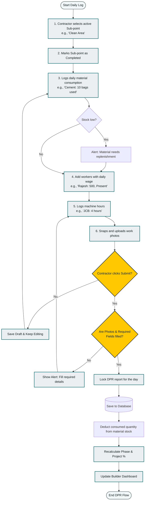
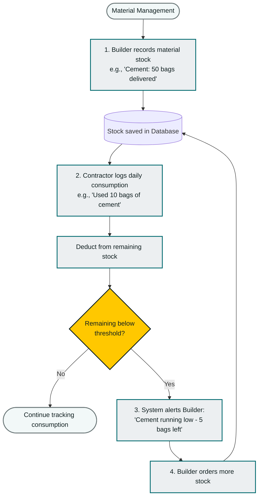

# BuildEx - System Design: Activity Diagrams (Flowcharts)

This document contains step-by-step **Activity Diagrams** (flowcharts) showing how the main processes in **BuildEx** work, including decisions, validations, and app updates.

---

## 1. Daily Progress & Site Logging (DPR) Workflow

This diagram shows how the Contractor submits the Daily Progress Report (DPR) and how the system recalculates the project progress percentage.

---

## 2. Material Stock & Low Stock Alert Workflow

This diagram shows how the Builder records initial material stock, the Contractor logs consumption, and the system alerts when stock needs replenishment.

---

## 3. Site Issue (Snag) Lifecycle

This diagram shows how quality or construction issues are reported, fixed, and closed.

