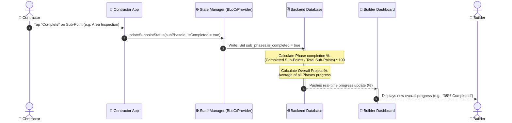
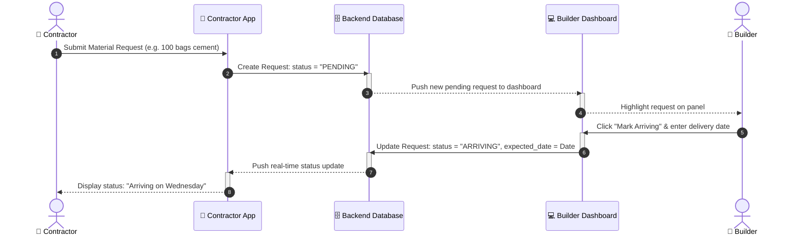
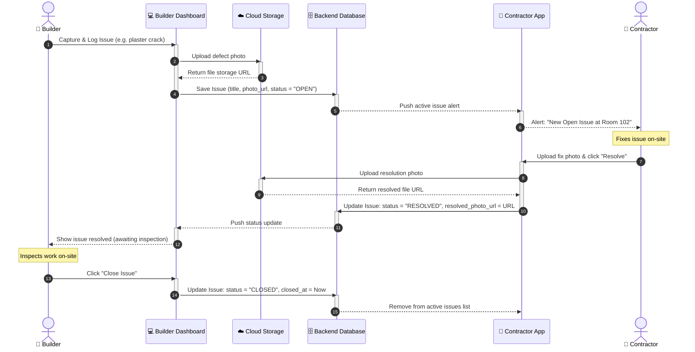

# BuildEx - System Design: Sequence Diagrams

This document contains **Sequence Diagrams** showing the step-by-step communication between the different parts of the **BuildEx** system (User -> Flutter App -> State Manager -> Backend Database) over time.

---

## 1. Progress Recalculation & Sync (DPR)

This diagram shows what happens when the Contractor marks a sub-point task completed, how the database recalculates the progress, and how it updates the Builder's dashboard.

---

## 2. Material Needs Request & status update to "Arriving"

This diagram shows how a material request from the Contractor goes to the Builder, gets approved, and is updated on the Contractor's phone.

---

## 3. Site Issue Logging & Resolution (Snag list)

This diagram shows the communication flow when reporting a defect, uploading a photo, fixing it, and closing the ticket.

