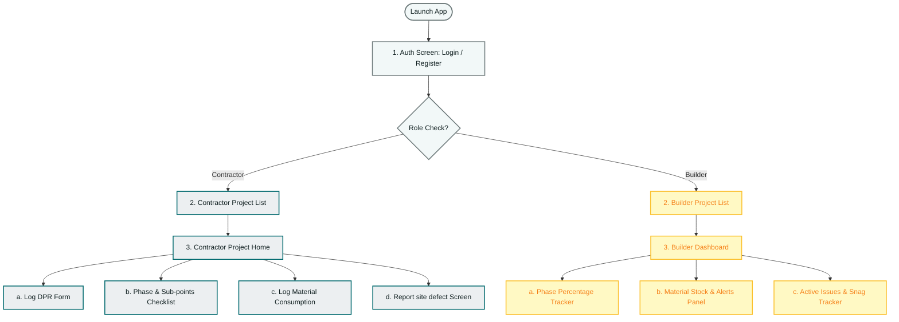
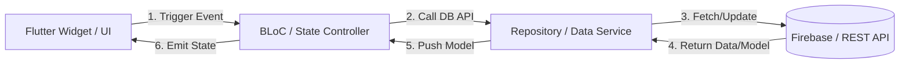

# BuildEx - System Design: UI & Mobile Architecture

This document describes the Flutter mobile application's UI hierarchy, state management, navigation structure, and visual design system.

---

## 1. App Navigation & Screen Hierarchy

BuildEx is split into two primary screen experiences based on the logged-in user's role (Builder vs. Contractor).

### Detailed Screen Profiles

#### A. Shared Screens
* **Login / Register Screen:** Email and password auth. Implicit role assignment (User registers via email; Builder by default, Contractor if previously assigned to a site via email).
* **Project Selection Screen:** Grid/list of active projects assigned to the user.

#### B. Contractor App Screens
* **Contractor Project Home:** Quick actions panel to log work, mark attendance, log material consumption, or check stock.
* **Phase Checklist Screen:** Collapsible list showing all Phases (e.g. Substructure) and Sub-points (e.g. Area Inspection) with simple checkmark boxes.
* **Daily Log Form (DPR):** Single-page scrollable form to input:
  * Worker attendance with name and daily wage (Present/Absent).
  * Machine operating hours.
  * Material quantities consumed today (deducted from stock).
  * Photo attachment from camera.
* **Material Consumption Form:** Select material from stock list and enter quantity used.
* **Snag Report Form:** Snaps a photo of the site issue, writes a brief description, and selects severity (Low/Medium/High).

#### C. Builder App Screens
* **Builder Dashboard Screen:** The primary screen for the Builder. Includes:
  * Overall project completion percentage.
  * Quick-stats cards: *Low Stock Alerts*, *Active Snags*, *Today's Labor Count*.
* **Phase Progress Screen:** Visual progress bars for each phase (e.g. *Phase 2 Digging: 75% completed*).
* **Material Stock Panel:** View stock levels per material, consumption trends, and low-stock alerts.
* **Site Issues Panel:** Lists active defects with photo thumbnails. Tapping an issue shows the before/after photos and the "Close Ticket" button.

---

## 2. State Management Architecture

BuildEx uses the **BLoC (Business Logic Component)** pattern to separate the UI layer from the database operations.

### Core BLoCs & States

1. **`AuthBloc`**
   * *Events:* `AppLaunched`, `LoginSubmitted`, `LogoutRequested`, `SignUpSubmitted`.
   * *States:* `AuthLoading`, `Authenticated(User)`, `Unauthenticated`, `AuthError`.
2. **`ProjectProgressBloc`**
   * *Events:* `LoadProjectProgress`, `ToggleSubpointCompletion(subPhaseId)`.
   * *States:* `ProgressLoading`, `ProgressLoaded(ProjectModel)`, `ProgressSyncError`.
3. **`MaterialStockBloc`**
   * *Events:* `LoadStockLevels`, `RecordStockDelivery(MaterialStock)`, `LogConsumption(usage)`.
   * *States:* `StockLoading`, `StockLoaded(List<MaterialStock>)`, `LowStockAlert`, `StockActionSuccess`.
4. **`DailyLogBloc`**
   * *Events:* `SubmitDPR(DailyLog)`, `LoadDPRHistory`.
   * *States:* `LogSubmitting`, `LogSubmittedSuccess`, `LogHistoryLoaded`.
5. **`SiteIssueBloc`**
   * *Events:* `LogNewIssue`, `ResolveIssue(issueId, fixPhotoUrl)`, `CloseIssue(issueId)`.
   * *States:* `IssuesLoading`, `IssuesLoaded(List<SiteIssue>)`, `IssueUpdatedSuccess`.

---

## 3. Design System & Styling Tokens

To create a clean and professional look matching the construction environment, BuildEx uses the following design tokens:

### A. Color Palette
* **Primary (Brand Identity):** `#00696E` (Deep Construction Teal)
* **Secondary (Accents & Primary Buttons):** `#FFC800` (Safety Yellow)
* **Background Dark (Builder Mode/Header):** `#0F1E1F` (Charcoal/Dark Teal)
* **Background Light (Contractor Input Forms):** `#F2F8F8` (Off-white/Muted Ice)
* **Status Colors:**
  * *Pending/Alert:* `#D32F2F` (Alert Red)
  * *Arriving/In-Progress:* `#FBC02D` (Amber Yellow)
  * *Delivered/Closed:* `#388E3C` (Success Green)

### B. Typography
* **Primary Font:** `Inter` (Standard, clean sans-serif for numbers, tables, and lists)
* **Secondary Font:** `Outfit` (Modern, rounded font used for large headings and dashboard metrics)
* **Scale:**
  * Title/Progress Hero: `32px` (Bold)
  * Sub-headings: `18px` (Medium)
  * Body/Logs: `14px` (Regular)
  * Labels/Details: `12px` (Light)
