# BuildEx - System Design: Page Redirection Flow

This document details the screen navigation and redirection architecture for the **BuildEx** application, mapped directly to the active screen IDs and titles in the **Stitch project `6775857487309455360`**.

---

## 1. Page Redirection Tree Chart (Stitch Mapping)

The diagram below illustrates the exact screen navigation flow. Role resolution occurs implicitly upon logging in:

```mermaid
graph TD
    %% Authentication & Entry
    A["Create Account (3a0d042f)"] --> B["Sign In (e716a31a)"]
    B --> C["My Projects - Quick Update Shortcuts (44ad4540)"]
    C -->|Click + Icon| C_Add["Add New Project (f46110e3)"]
    C_Add -->|Submit| C
    
    %% Role Fork (Implicit)
    C -->|Project Selected: Contractor| D["Project Hub (edcb32cd)"]
    C -->|Project Selected: Builder| E["Project Dashboard (c041fbbb)"]
    
    %% Contractor Redirections
    subgraph Contractor Flow
        D -->|Bottom Tab: Projects| D
        D -->|Bottom Tab: Tasks| F["My Tasks (6fc9ba72)"]
        F -->|Click Task Card| G["Task Details (4439d870)"]
        
        D -->|Bottom Tab: Team| H["My Team (8b06dea2)"]
        H -->|Click Invite Button| I["Invite Team Member (7e385eb0)"]
        
        D -->|Bottom Tab: Profile| J["My Profile (b136f4d8)"]
        
        %% Action Grid
        D -->|Grid Action: Phase Checklist| K["Phase Checklist (7e23b7cf)"]
        D -->|Grid Action: Site Photos| L["Site Photos (86113211)"]
        D -->|Grid Action: Labor Attendance| M["Worker Attendance - 390px Base (af60e6b8)"]
        M -->|Click View History| N["Attendance History (dda387cd)"]
        D -->|Grid Action: Material Log| O["Material Log - 390px Base (1a3953bc)"]
        
        %% Progress & Issues
        D -->|Grid Action: Progress Notes| P["Daily Progress (fbe6099b)"]
        D -->|Card: Report Issue / Defect| Q["Report Issue - Premium Redesign (76203631)"]
        D -.->|Alternative Snag Form| Q_Alt["Report Issue - 390px Base (d65dc000)"]
        
        %% Daily Log Submission
        D -->|Button: SUBMIT DAILY REPORT| R["Daily Report Summary (1ed6f3d5)"]
        R -->|Click Submit & Approve| D
    end
    
    %% Builder Redirections
    subgraph Builder Flow
        E -->|Bottom Tab: Projects| E
        E -->|Bottom Tab: Tasks| F2["My Tasks (6fc9ba72)"]
        F2 -->|Click + Add Task| F2_Add["Add New Task (ed5624f9)"]
        F2_Add -->|Submit| F2
        
        E -->|Bottom Tab: Team| H2["My Team (8b06dea2)"]
        E -->|Bottom Tab: Profile| J2["My Profile (b136f4d8)"]
        
        %% Interactive Rows & Progress Ring
        E -->|Tap Overall Progress Ring| S["Phase Progress (3d0cf5c6)"]
        E -->|Tap 'Daily Progress' Row| T["Daily Reports History (e48c5a51)"]
        E -->|Tap 'Worker Attendance' Row| U["Attendance History (dda387cd)"]
        
        E -->|Tap 'Material Log' Row| V["Material Stock Panel (8f7443f5)"]
        V -->|Click 'Record Stock Delivery' Button| W["Record Stock Delivery (d33ac2fc)"]
        W -->|Submit Delivery| V
        
        E -->|Tap 'Open Issues' Row| X["Issues & Defects Tracker (37b3a92c)"]
        X -->|Click Snag Card| Y["Issue Detail #104 (8f23f2c3)"]
        Y -->|Click Close/Resolve| X
        
        %% Audit
        E -->|Button: VIEW DAILY REPORT DETAILS| Z["Daily Report Audit (f955a7a5)"]
        Z -->|Click Approve Log| E
    end
    
    %% Style Definitions
    classDef default fill:#F2F8F8,stroke:#6d797a,stroke-width:1px,color:#0f1e1f;
    classDef highlight fill:#ffc800,stroke:#1f2d2e,stroke-width:2px,color:#1f2d2e;
    classDef teal fill:#20aeb5,stroke:#00696e,stroke-width:2px,color:#ffffff;
    
    class A,B,C,C_Add default;
    class D,E teal;
    class W,R,Z,Q,K,S,V,F2_Add,Q_Alt highlight;
```

---

## 2. Navigational Redirection Triggers

### A. Authentication & General Setup
1. **`Create Account (3a0d042f)` $\rightarrow$ `Sign In (e716a31a)`:** Clicking the "Sign In" link redirects users to the login screen.
2. **`Sign In (e716a31a)` $\rightarrow$ `My Projects - Quick Update Shortcuts (44ad4540)`:** Logging in forwards the user to their project selection feed.
3. **Project Addition:** In the projects feed, tapping the addition button opens `Add New Project (f46110e3)`. Submitting returns to the main projects list.

---

### B. Contractor Redirections (`Project Hub` ID: `edcb32cd`)
* **`Phase Checklist (7e23b7cf)`:** Triggered by tapping the **"Phase Checklist"** button in the top-left of the action grid.
* **`Site Photos (86113211)`:** Triggered by tapping the **"Site Photos"** action grid button.
* **`Worker Attendance - 390px Base (af60e6b8)`:** Triggered by tapping **"Labor Attendance"** in the action grid. Tapping "View History" redirects to `Attendance History (dda387cd)`.
* **`Material Log - 390px Base (1a3953bc)`:** Triggered by tapping **"Material Log"** in the action grid.
* **`Daily Progress (fbe6099b)`:** Triggered by tapping **"Progress Notes"** in the action grid to edit run-hours and logs.
* **`Report Issue - Premium Redesign (76203631)`:** Triggered by clicking the **"Report Issue / Defect"** card. (Note: `Report Issue - 390px Base (d65dc000)` serves as an alternative layout variant for this snag form).
* **`Daily Report Summary (1ed6f3d5)`:** Triggered by clicking the primary **"SUBMIT DAILY REPORT"** button. Tapping submit on the summary completes the DPR submission and routes the Contractor back to `Project Hub`.

---

### C. Builder Redirections (`Project Dashboard` ID: `c041fbbb`)
* **`Phase Progress (3d0cf5c6)`:** Triggered by tapping the circular overall progress card ("View Detailed Phase Progress").
* **`Daily Reports History (e48c5a51)`:** Triggered by tapping the **"Daily Progress"** checked row in the Daily Summary card.
* **`Attendance History (dda387cd)`:** Triggered by tapping the **"Worker Attendance"** checked row in the Daily Summary card.
* **`Material Stock Panel (8f7443f5)`:** Triggered by tapping the **"Material Log"** checked row in the Daily Summary card. Clicking **"Record Stock Delivery"** inside this panel routes the Builder to the `Record Stock Delivery (d33ac2fc)` form.
* **`Issues & Defects Tracker (37b3a92c)`:** Triggered by tapping the **"Open Issues"** row in the summary. Tapping an individual issue routes to `Issue Detail #104 (8f23f2c3)`.
* **`Daily Report Audit (f955a7a5)`:** Triggered by clicking the primary bottom button **"VIEW DAILY REPORT DETAILS"** to inspect and approve logs.

---

## 3. Meta & Overview Screens (Non-Navigational)
The following screen is stored in the project canvas for documentation and design system visualization, and does not participate in the live mobile application routing:
* **`BuildTrack Construction Management Flow (f86d932c)`:** Interactive canvas diagram illustrating component alignments.
